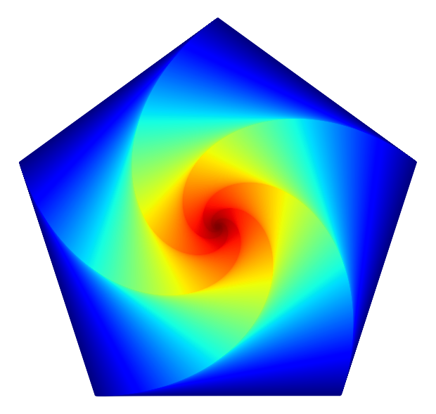
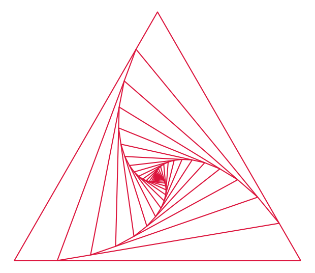
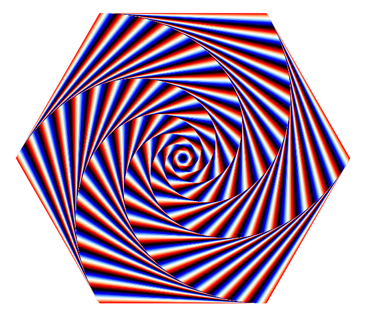
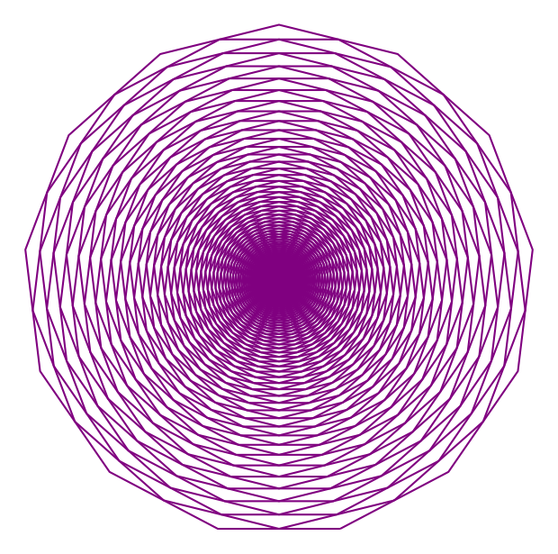

# itero

Visualization of iterative transformations.

`itero` is a lightweight Python package for visualising iterative linear interpolation on regular polygons. It builds a sequence of shrinking, rotating polygon shapes and renders the result as elegant line art.



---

## Features

- Generate regular polygons with configurable side counts
- Apply repeated vertex interpolation to create smooth evolving patterns
- Automatically compute a visually appropriate iteration count
- Render with either Matplotlib or Plotly, and save to PNG, SVG, PDF, or other supported formats
- Colour each polygon with a fixed colour, or a gradient colormap (the default) using Matplotlib colormaps or Plotly colorscales, depending on the selected backend
- Command-line interface for quick experimentation and art generation

---

## Installation

Not published on PyPI, but pip installs directly from GitHub just as easily:

```bash
pip install git+https://github.com/david-danka/itero.git
```

Saving Plotly output to disk with `--save-path` (as opposed to just displaying it) requires the optional `kaleido` package:

```bash
pip install "git+https://github.com/david-danka/itero.git#egg=itero[image-export]"
```

Matplotlib's `--save-path` works without any extra install.

---

## Quick start

```bash
itero --num-sides 6 --ratio 0.2 --iterations 500 --color indigo --alpha 0.15 --save-path output.png
```

This generates a polished figure of the polygon iteration sequence and saves it to `output.png`. `python -m itero ...` works identically, if you prefer running it as a module.

---

## Command-line options

```bash
itero [options]
```

Options:

- `-n`, `--num-sides` — number of sides for the regular polygon (minimum 3)
- `-i`, `--iterations` — number of iterative transforms to apply; if omitted, computed automatically to fill the figure
- `-r`, `--ratio` — interpolation ratio between vertices for each step
- `-m`, `--cmap` — colormap/colorscale name for gradient colouring (e.g. `viridis`), in the naming scheme of whichever `--backend` is selected; used by default when neither `--cmap` nor `--color` is given
- `-c`, `--color` — fixed plot colour instead of a gradient, accepted by whichever `--backend` is selected (Matplotlib colour names/hex strings, or Plotly colour names/hex/`rgb()`)
- `-a`, `--alpha` — opacity for each polygon line, between `0.0` and `1.0`
- `--figure-size` — figure width and height in inches
- `--save-path` — save the rendered figure to disk
- `--no-show` — suppress the interactive figure window when saving only
- `--backend` — rendering backend to use, `matplotlib` (default) or `plotly`

---

## Example commands

Create a sparse triangular pattern:

```bash
itero --num-sides 3 --ratio 0.15 --iterations 400 --color crimson --save-path images/sparse_triangle.png
```



Generate a dense, soft square pattern — a `--ratio` close to 1 shrinks the polygon only a
little per step (the same effect as a `--ratio` close to 0, just approaching from the other
side), so it takes many auto-computed iterations to converge:

```bash
itero --num-sides 4 --ratio 0.997 --color teal --alpha 0.25 --save-path images/dense_square.png
```


`turbo`, `rainbow`, and `jet` sweep through many hues rather than shading a single one, so a
dense, tightly-packed iteration (via a `--ratio` near 0 or 1) shows off their full range:

```bash
itero --num-sides 5 --ratio 0.001 --cmap jet --save-path images/jet_pentagon.png
```


Matplotlib's cyclic `flag` colormap, pushed dense, produces a hypnotic barber-pole effect:

```bash
itero --num-sides 6 --ratio 0.999 --cmap flag --save-path images/flag_hexagon.png
```



Create a vibrant heptadecagon iteration:

```bash
itero --num-sides 13 --ratio 0.5 --iterations 800 --color purple --save-path images/vibrant_heptadecagon.png
```



Every example above works identically with `--backend plotly` in place of the Matplotlib
default — add `--backend plotly` to any of them.

---

## Development setup

To work on itero itself, clone the repo and install it editable:

```bash
git clone https://github.com/david-danka/itero.git
cd itero
python -m venv .venv
```

```powershell
.\.venv\Scripts\Activate.ps1
python -m pip install -e ".[image-export]"
```

```bash
source .venv/bin/activate
python -m pip install -e ".[image-export]"
```

---

## Project structure

- `src/itero/` — package source code
- `tests/` — unit tests for geometry and transformation behaviour
- `docs/` — supporting documentation
- `images/` — generated example output images
